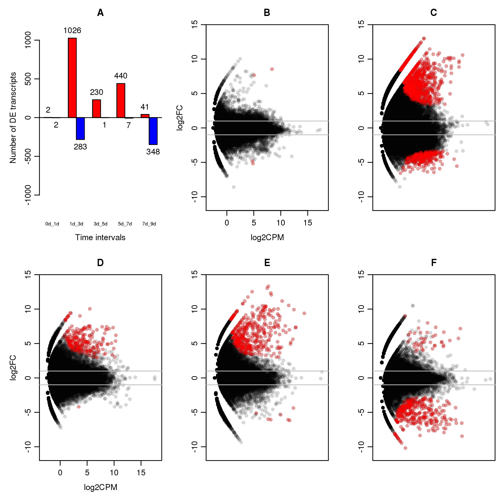

Analyses
========

Based on [Helm et al. 2013](http://www.biomedcentral.com/1471-2164/14/266)

---

All 217.8 million reads from experiment (11 samples combined) and 464.4 million
reads from reference reads passed Illumina chastity filter. Reference assembled
with Agalma 0.3.5.

Summary
-------

1. [00_map_to_reference.sh](00_map_to_ref.sh) Build reference assembly index
and map reads to it with Bowtie2.
2. [01_calculate_read_count.sh](01_calculate_read_count.sh) Calculate read
counts for each transcript of every sample.
3. [02_import_to_r.sh](02_import_to_r.sh) Load read counts and build main data
frame in R.
4. [03_normalize.sh](03_normalize.sh) Normalize data with edgeR.
5. [04_stem_profiles.sh](04_stem_profiles.sh) Calculate average for STEM
analysis.
6. [05_import_stem.sh](05_import_stem.sh) Import STEM output to R again.
7. [06_plot_replicates.sh](06_plot_replicates.sh) Build scatter plots between
replicates.
8. [08_test_expression.sh](07_test_expression.sh) Use edgeR to calculate the
confidence for differential gene expression.

Mapping reads
-------------

Build reference index using `bowtie2-build`:

    /usr/local/src/bowtie2-2.0.0-beta7/bowtie2-build reference/Pc_ref.fa reference/Pc_ref > reference/bowtie2-build.log 2>&1 &

Map each sample to reference. Example below:

    /usr/local/src/bowtie2-2.0.0-beta7/bowtie2 --phred33 --very-sensitive-local -a -p 10 -x reference/Pc_ref -U data/Pc1_0d.txt.gz -S mapped_reads/Pc1_0d_bowtie.map > mapped_reads/Pc1_0d.log 2>&1 &
    ...

Calculate read counts
---------------------

Calculate the number of reads mapping to each reference transcript. I used a
slightly modified version of the `bowtie_map_to_counts.py` script from [Helm et
al. 2013][Helm2013_bowtie]

**Source:** [bowtie_map_to_counts.py](bowtie_map_to_counts.py)

Run command for each sample:

    ./bowtie_map_to_counts.py mapped_reads/Pc1_0d_bowtie.map > read_count_per_transcript/Pc1_0d.counts &
    ...

[Helm2013_bowtie]: http://www.biomedcentral.com/content/supplementary/1471-2164-14-266-s8.py

Importing data to R
-------------------

Load read counts per transcript for each time point into R. Then merge all
values into a data frame. Following the steps of matrix generation script from [Helm et al.
2013][Helm2013_load].

**Source:** [load_read_counts.r](load_read_counts.r)

[Helm2013_load]: http://www.biomedcentral.com/content/supplementary/1471-2164-14-266-s9.r

TODO: Build matrix on Python with Pandas.

Normalize data with edgeR
-------------------------

Use [edgeR][edgeR_url] to calculate the normalization factor between samples.
Get the effective size of each column by multiplying the actual size (sum of
counts) against the normalization factor. Generate a multiplier for "counts per
million" dividing 1 million by the effective size. Use multiplier against counts.

**Source:** [edger_normalize.r](edger_normalize.r)

[edgeR_url]: http://www.bioconductor.org/packages/release/bioc/html/edgeR.html

TODO: Is there a way to do it on Python? Check function for calculating the
normalization factor.

STEM analysis
-------------

Calculate the average for read counts between replicates. Bind data to main
data frame and write table to be used for the STEM analysis.

**Source:** [stem_prepare.r](stem_prepare.r)

Format of the output average file needs to be adjusted using regular expressions.

**Source:** [format_to_stem.sh](format_to_stem.sh)

Run STEM with the following command:

    java -mx1024M -jar ~/src/stem/stem.jar

Default settings used as shown below (see [complete output](stem/stem_output)):

    #Main Input:
    Data_File   /home/nelas/Biologia/Doutorado/Priapulus/rna/RNAseq_profiling/stem/avg_stem_input
    Gene_Annotation_Source  No annotations
    Gene_Annotation_File
    Cross_Reference_Source  No cross references
    Cross_Reference_File
    Gene_Location_Source    No Gene Locations
    Gene_Location_File
    Clustering_Method[STEM Clustering Method,K-means]   STEM Clustering Method
    Maximum_Number_of_Model_Profiles    50
    Maximum_Unit_Change_in_Model_Profiles_between_Time_Points   2
    Normalize_Data[Log normalize data,Normalize data,No normalization/add 0]    Normalize data
    Spot_IDs_included_in_the_data_file  false

From the initial 58133 transcripts, STEM filtered out 33023 while 25110 passed
the filter. Below are the profiles found ordered by transcript abundance and
significance:

Relevant profiles:

| profile                                        | description                               |
| :------:                                       | :----------                               |
| [profile 8][profile_8]                         | constant decrease from initial oocytes    |
| [profile 39][profile_39]                       | constant increase from initial oocytes    |
| [profile 31][profile_31]                       | peak at 3d coincident with gastrulation   |
| [profile 25][profile_25]                       | peak at 3d but drastically downregulated  |
| [profile 22][profile_22]                       | peak at 7d coincident with introvertula   |
| [profile 17][profile_17] and [18][profile_18]  | low during cleavage, then up              |
| [profile 1][profile_1]                         | low expression since cleavage             |

[profile_8]: stem/profile_8
[profile_39]: stem/profile_39
[profile_31]: stem/profile_31
[profile_25]: stem/profile_25
[profile_22]: stem/profile_22
[profile_17]: stem/profile_17
[profile_18]: stem/profile_18
[profile_1]: stem/profile_1

Output file was created manually by saving the **Main Table for Genes Passing
Filter** as `genes_passing_filter`. This file needs to be edited to be imported
back into R. The script below was made for that:

**Source:** [format_from_stem.sh](format_from_stem.sh)

Put STEM profiles into R and merge with main data frame.

**Source:** [stem_import.r](stem_import.r)

Replicate plots
---------------

Plotting the normalized average count between replicates, except for 7d sample.

**Source:** [build_scatter_plots.r](build_scatter_plots.r)

Differential expression
-----------------------

This scripts runs step-by-step the test for differential gene expression as follows:

1. Subset read counts by interval and define available time points.
2. Create DGEList object for running the test.
3. Calculate the normalization factor and dispersion.
4. Run test and output a table with counts of significant genes.

**Source:** [test_dge.r](test_dge.r)

Dispersion values for each interval:

| interval | dispersion | bcv
| :------: | :--------: | :-:
| 0d_1d    | 0.43092    | 0.6564
| 1d_3d    | 0.32958    | 0.5741
| 3d_5d    | 0.26231    | 0.5122
| 5d_7d    | 0.21773    | 0.4666
| 7d_9d    | 0.15213    | 0.39

Plots for differentially expressed genes
----------------------------------------

**Source:** [build_de_plots.r](build_de_plots.r)

Gene ontology
-------------

1. Parse accession numbers from annotated assembly.
2. Use [Entrez](http://www.ncbi.nlm.nih.gov/sites/gquery), [Uniprot](http://www.uniprot.org/), and [EBI
QuickGO](http://www.ebi.ac.uk/QuickGO/) to fetch list of GO ids associated with
the protein. (should I fetch InterPro?)
3. For each GO id fetch hierarchy, terms, and evidence codes.
4. Associate terms with contigs.
5. Done.
